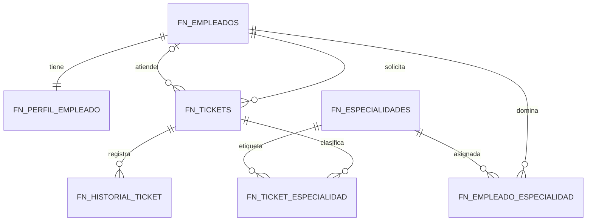
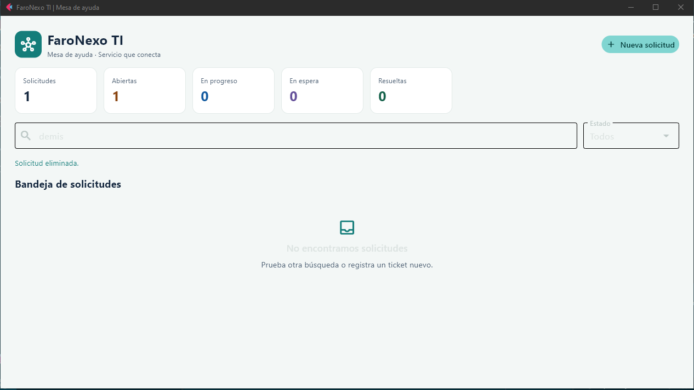

# FaroNexo TI

FaroNexo TI es una mesa de ayuda para registrar, asignar y seguir solicitudes de soporte de una organización. Reúne en una bandeja el estado, la prioridad, la persona solicitante, el técnico responsable y las áreas de especialidad relacionadas con cada caso.

## Problema que resuelve

Las solicitudes que llegan por distintos canales se pierden con facilidad y dejan poco rastro de quién las atiende. FaroNexo centraliza los tickets y su historial para que el equipo pueda priorizar el trabajo, asignarlo y explicar cómo se resolvió.

## Funciones

- Crear, consultar, editar y eliminar tickets.
- Buscar por asunto, descripción, solicitante o técnico y filtrar por estado.
- Asignar técnicos y vincular cada ticket a una o varias especialidades.
- Ver información relacionada en cada solicitud y consultar el historial de estados.
- Cerrar tickets mediante un procedimiento que valida la resolución.
- Consultar un resumen agrupado por estado.
- Mostrar mensajes de éxito, validación y error sin cerrar la aplicación.

## Tecnologías

- Python y Flet para la interfaz.
- MySQL para persistencia, integridad y lógica de base de datos.
- PyMySQL y python-dotenv para conexión y configuración.

## Modelo de datos

El esquema crea siete tablas con prefijo `fn_` para evitar colisiones con tablas preexistentes de la base:

| Tabla | Propósito |
| --- | --- |
| `fn_empleados` | Solicitantes y técnicos del sistema. |
| `fn_perfil_empleado` | Datos organizacionales; comparte la clave primaria con `fn_empleados` para implementar 1:1. |
| `fn_especialidades` | Áreas de soporte disponibles. |
| `fn_empleado_especialidad` | Tabla puente para técnicos con varias especialidades (N:M). |
| `fn_tickets` | Solicitudes, con solicitante, técnico, estado, prioridad y resolución. Un empleado puede registrar varios tickets (1:N). |
| `fn_ticket_especialidad` | Tabla puente que relaciona tickets con una o varias especialidades (N:M). |
| `fn_historial_ticket` | Cambios de estado registrados por el trigger. |

Las claves foráneas, restricciones `CHECK`, valores únicos y acciones `ON DELETE` protegen la integridad. La bandeja consulta tickets y nombres mediante `JOIN`; el panel superior agrupa el total por estado.



### Trigger y procedimiento

- `fn_historial_ticket_insert` guarda el estado inicial, `fn_historial_ticket_update` registra las transiciones y `fn_actualizar_ticket` mantiene las marcas de tiempo.
- `fn_cerrar_ticket(id, resolucion)` bloquea el registro mientras valida que exista, no esté cerrado y tenga una resolución de al menos 10 caracteres. La aplicación utiliza el procedimiento al cerrar cada caso.

En servidores con registro binario habilitado, el proveedor puede restringir `CREATE TRIGGER` a administradores. Si aparece el error MySQL 1419, un administrador debe crear los triggers del archivo `sql/02_triggers.sql` o ajustar la configuración del servidor según la política del servicio.

## Requisitos

- Python 3.11 o posterior.
- MySQL 8.0.16 o posterior para aplicar restricciones `CHECK`.
- Acceso a una base MySQL y permiso para crear tablas, triggers y procedimientos.

> El proyecto utiliza MySQL mediante PyMySQL. Configura el host y el puerto según tu instancia en el archivo `.env`.

## Puesta en marcha

1. Crea y activa un entorno virtual:

   ```powershell
   py -m venv .venv
   .\.venv\Scripts\Activate.ps1
   ```

2. Instala las dependencias:

   ```powershell
   pip install -r requirements.txt
   ```

3. Copia `.env.example` como `.env` y completa las credenciales de tu propia base local. `.env` está excluido de Git; nunca publiques contraseñas ni credenciales reales.

4. Confirma el host, el puerto y el nombre de base en `.env` antes de inicializar. El esquema usa nombres con prefijo `fn_` para convivir con tablas existentes. Si el nombre contiene `prod`, el inicializador exige escribir `AUTORIZO-PRODUCCION` y después `APLICAR` antes de modificar la base:

   ```powershell
   python setup_database.py
   ```

   Los datos iniciales usan correos de ejemplo bajo `faronexo.local`; reemplázalos por los integrantes de tu organización si corresponde.

5. Inicia la aplicación mientras `.env` siga apuntando a esa base de desarrollo:

   ```powershell
   python app.py
   ```

Captura de la aplicación:



## Estudiante

Rodrigo Parra
